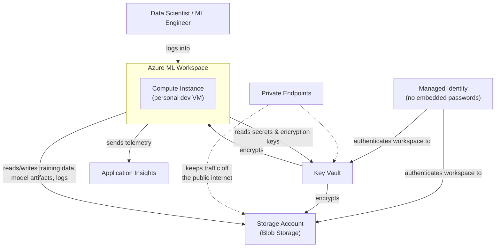
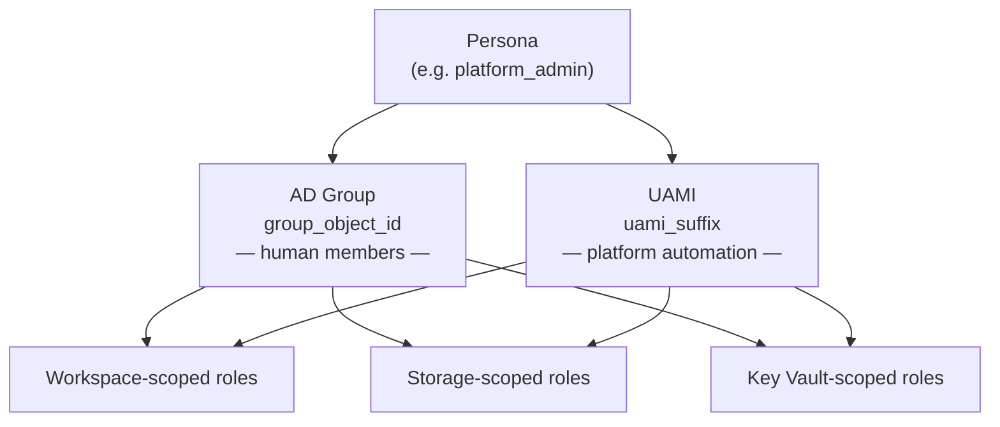

# AITAPA — Architecture & Role Model

**Notion page:** https://app.notion.com/p/3b57a5e7c4ee81a3ba5dd82fac2c8989

Prepared for Deepak — August 7, 2026. Scope of this doc: (1) what's built and why each piece exists, (2) how the persona-based access model actually tags identities, and why each specific role is attached. Status/timeline and open decisions live in the companion technical doc (linked at the bottom) so this one stays focused.

## 1. Current Architecture

| Component | What it is | Why it's here |
|---|---|---|
| **Azure ML Workspace** | The control plane — ties together compute, data, and experiment tracking | Lets a data scientist run a training job, log results, register a model, and deploy it, all from one place |
| **Storage Account (Blob Storage)** | Object storage for training data, model artifacts, logs, notebook outputs | Built for large unstructured files (unlike a database); Azure ML's Datastores/Data Assets are native on top of blob containers; supports private endpoints and lifecycle tiering |
| **Key Vault** | Holds secrets and encryption keys (including the CMEK key) | Centralizes credentials so nothing is hardcoded in notebooks/pipeline code; access to secrets is controlled separately by RBAC |
| **Managed Identity (UAMI)** | An Azure-issued identity, one per persona (see Section 2) | Lets the workspace/compute authenticate to Storage and Key Vault with no embedded password — access can be granted or revoked instantly via role assignment |
| **Private Endpoints** | Puts Storage/Key Vault traffic onto Azure's private backbone | The resource isn't reachable from the public internet at all — required for a regulated environment |
| **Application Insights** | Telemetry collector for the workspace and deployed endpoints | Lets problems get diagnosed after the fact instead of only when someone notices |
| **CMEK** | A customer-supplied encryption key, instead of Azure's default Microsoft-managed key | Required to close a Prisma security-scanning finding — gives full control over key rotation, revocation, and audit trail |

## 2. Roles & Personas

### 2.1 How a persona is tagged

There's no single "access level" — each persona is tagged **twice**, and both tags get the identical set of role assignments:

- **AD Group** — real humans get added/removed here. This is what a person is actually a member of.
- **UAMI (Managed Identity)** — a dedicated automation identity for that persona. When the platform itself does something on that persona's behalf (e.g. the workspace reading training data as `ml_engineer`), it runs under this identity, not a shared "do everything" one.
- Both get **exactly the same roles**, at three separate scopes (Workspace, Storage, Key Vault) — so a human in `ml_engineer` and the platform acting as `ml_engineer` have identical, auditable permissions. Nothing is granted to the automation that a human in that role couldn't also do.

### 2.2 Why each role is attached, persona by persona

Roles marked **(NEW)** or **(UPDATED)** came from Harsha's fuller list and are still pending confirmation on the exact persona mapping — included here so the rationale is visible while that's being finalized.

#### platform_admin — runs and maintains the platform itself

| Role | Scope | What it actually grants | Why platform_admin has it |
|---|---|---|---|
| Contributor | Workspace | Full read/write management of the workspace resource — can't manage who else has access | Has to actually configure and maintain the workspace |
| AzureML Compute Operator | Workspace | Create/start/stop/resize compute instances and clusters | Provisions and manages the underlying compute |
| Storage Blob Data Contributor | Storage | Read/write/delete blob **data** (containers & blobs) | Needs to manage the actual data, not just the account's settings |
| Storage Contributor **(NEW)** | Storage | Manage the storage account's own configuration (network rules, containers, lifecycle policy) — management plane, not blob contents | Needed to maintain the account itself — this is literally the role that fixes things like the SCUS outbound-rules gap found this week |
| Storage File Data Privileged Contributor **(NEW)** | Storage | Elevated data access that bypasses directory-level ACL checks | For admin/automation writes that must succeed regardless of folder-level permissions |
| Reader **(NEW)** | Storage | Read-only view of the storage account's **configuration** (not blob contents — see note below) | Oversight without needing a separate audit path |
| Azure AI Enterprise Network Connection Approver **(NEW)** | Storage | Approve pending private-endpoint connection requests targeting this resource | So the platform's automation can approve PE connections during provisioning instead of a human clicking Approve in the portal each time |
| Key Vault Contributor | Key Vault | Manage vault configuration (network rules, etc.) — not secret/key contents | Maintains the vault's own settings |
| Key Vault Crypto Officer **(NEW)** | Key Vault | Full lifecycle management of keys — create, rotate, delete — without necessarily using them | Manages the CMEK key's lifecycle (rotation, revocation) |
| Key Vault Crypto Service Encryption User **(NEW)** | Key Vault | Lets a principal actually *use* a key for encrypt/decrypt, with no other key-management rights | This is the specific role that makes CMEK work — it's what lets the identity wrap/unwrap data with the key |
| Reader **(NEW)** | Key Vault | Read-only view of vault configuration | Oversight |

#### ml_engineer — builds and deploys ML pipelines

| Role | Scope | What it actually grants | Why ml_engineer has it |
|---|---|---|---|
| AzureML Data Scientist | Workspace | Run experiments/pipelines, register models — can't administer compute or workspace settings | This is the "do ML work" role |
| AzureML Compute Operator | Workspace | Create/start/stop/resize compute | Manages their own pipeline compute — this is what distinguishes ml_engineer from data_scientist |
| Storage Blob Data Contributor | Storage | Read/write/delete blob data | Reads training data, writes model artifacts/checkpoints |
| Key Vault Crypto Officer **(UPDATED)** | Key Vault | Full key lifecycle management | Broader than a typical human "user" role usually needs — **flagged as an open question**, not yet confirmed this is the intended scope for a human persona |
| Key Vault Crypto Service Encryption User **(NEW)** | Key Vault | Use the key to encrypt/decrypt | Lets their compute read/write CMEK-encrypted data |
| Reader **(NEW)** | Key Vault | Read-only view of vault configuration | Oversight |
| AMPLS Scoped Resources Linker - wf2 **(NEW, not yet wired into Terraform)** | App Insights | Links a resource into an Azure Monitor Private Link Scope | Needed only if telemetry has to flow over the private network — still needs its own `role_assignment` block since it doesn't fit the flat `workspace/storage/kv` pattern |

#### data_scientist — develops and experiments with models

Same role set as ml_engineer, minus `AzureML Compute Operator` — data_scientist can run experiments but doesn't manage compute:

| Role | Scope | What it actually grants | Why data_scientist has it |
|---|---|---|---|
| AzureML Data Scientist | Workspace | Run experiments/pipelines, register models | The "do ML work" role, without compute administration |
| Storage Blob Data Contributor | Storage | Read/write/delete blob data | Reads training data, writes model artifacts |
| Key Vault Crypto Officer **(UPDATED)** | Key Vault | Full key lifecycle management | Same open question as ml_engineer above |
| Key Vault Crypto Service Encryption User **(NEW)** | Key Vault | Use the key to encrypt/decrypt | Reads/writes CMEK-encrypted data |
| Reader **(NEW)** | Key Vault | Read-only view of vault configuration | Oversight |
| AMPLS Scoped Resources Linker - wf2 **(NEW, not yet wired)** | App Insights | Links resource into Private Link Scope | Same as ml_engineer, if telemetry needs the private path |

#### reader — oversight / audit, no changes

| Role | Scope | What it actually grants | Why reader has it |
|---|---|---|---|
| Reader | Workspace | View-only — no changes | Pure oversight persona |
| Reader | Storage | View-only on the storage account's **configuration** | ⚠️ Worth confirming: plain `Reader` sees account settings, not blob **contents**. If the intent is for this persona to actually browse/download blob data (not just see that the account exists), the correct role is `Storage Blob Data Reader` instead — a data-plane role. As written today, `reader` cannot see inside the containers. |
| Reader | Key Vault | View-only on vault configuration | Same pattern — sees vault settings, not secret values (which is expected/desired here) |

Full technical detail (Terraform code, line-by-line findings, sandbox test plan, open decisions, comparison against a colleague's reference implementation) is in the companion architecture review doc.
