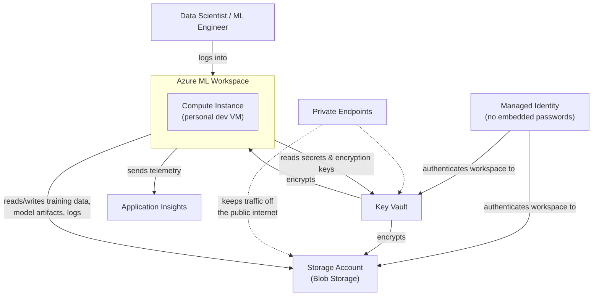
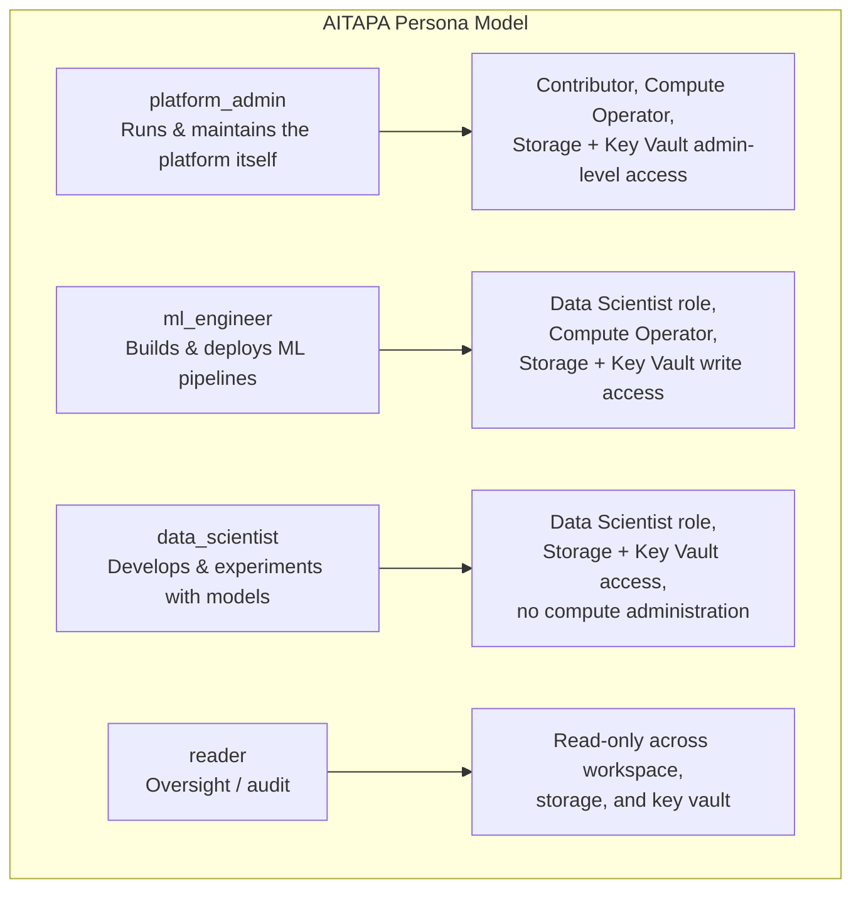

# AITAPA Status & Persona-Based Access Model — For Deepak

**Notion page:** https://app.notion.com/p/3b57a5e7c4ee81a3ba5dd82fac2c8989

Built 2026-08-07 for Deepak's call. Purpose: show current state of the AITAPA (Azure ML) platform, and explain in depth what the persona-based access redesign is, why each piece of the architecture exists, and where things stand.

## 1. Status Summary

| Area | Status |
|---|---|
| Persona-based RBAC design | Designed, GUIDs confirmed, code written for SCUS |
| Terraform `init`/`plan` | `init` blocker (401 on module registry) resolved today; `plan` running now |
| SCUS outbound network rules | Gap found during testing (was blocking package installs), fix written |
| CMEK | Temporarily decoupled for this test round only — required for a Prisma security finding, will be re-enabled before this is called done |
| EUS (second region) | Out of scope for this round — turns out it was never a deliberate second region, just a capacity overflow when SCUS hit a limit holding a workspace in soft-delete |
| Open decisions needed from you | See Section 5 |

## 2. What AITAPA Is, and Why Each Piece Exists

AITAPA (Artificial Intelligence Tachyon Predictive Azure ML) is the Azure-side counterpart to the team's existing GCP ML platform (AITAPC). It gives data scientists and ML engineers a managed environment to develop, train, and eventually serve models, without each person needing to hand-provision cloud infrastructure themselves.

**Azure ML Workspace** — this is the control plane. It's what ties together compute, data, and experiment tracking into one place, so a data scientist can run a training job, log the results, register the resulting model, and later deploy it, all from one environment instead of hand-wiring VMs, storage, and logging together themselves.

**Storage Account (Blob Storage)** — every ML workspace needs somewhere to persist things: training datasets, model checkpoints/artifacts, pipeline logs, notebook outputs. Blob storage is the right fit here specifically because:
- It's built for large, unstructured files (a training dataset or a saved model can be gigabytes), and is cheap and fast at that scale — unlike a database, which is built for structured, queryable records.
- Azure ML's own abstractions (Datastores, Data Assets) are built directly on top of blob containers — this isn't a custom integration, it's the native pattern the platform expects.
- It supports private endpoints, so the workspace can read/write data without that traffic ever touching the public internet — important for a regulated environment.
- It supports lifecycle tiering (hot/cool/archive), so old experiment data can automatically age out to cheaper storage instead of needing manual cleanup.

**Key Vault** — holds secrets and encryption keys: the CMEK key described below, plus any credentials the workspace needs to reach other systems. Centralizing this means credentials are never hardcoded into notebooks or pipeline code — code references a Key Vault secret by name, and access to actually read that secret is controlled separately by RBAC.

**CMEK (Customer-Managed Encryption Key)** — by default, Azure encrypts your data with a Microsoft-managed key. CMEK means AITAPA supplies and controls its own encryption key instead, stored in the Key Vault above. This matters because it gives full control over the key's lifecycle (rotation schedule, ability to revoke it, audit trail of who used it) rather than trusting Microsoft's default. This was specifically required to close a Prisma security-scanning finding — the earlier non-CMEK workspace was flagged as a vulnerability, and CMEK migration was the fix. (This is why it's being temporarily — not permanently — turned off during this test round, and must go back on before we call anything done.)

**Managed Identity (UAMI)** — instead of the workspace or compute instance holding a password/API key to talk to Storage or Key Vault, Azure issues it an identity that Azure itself vouches for. This is strictly more secure: there's no secret sitting in a config file that could leak, and access can be granted or revoked instantly via role assignment, the same as it would for a human account.

**Private Endpoints** — normally, talking to a Storage Account or Key Vault happens over their public internet-facing endpoint (protected by a password/key). A private endpoint instead puts that traffic onto Azure's private backbone network, so the resource simply isn't reachable from the public internet at all — a much stronger security posture, standard for anything handling potentially sensitive data.

**Application Insights** — collects telemetry (errors, performance, usage) from the workspace and any deployed model endpoints, so problems can be diagnosed after the fact instead of only when someone happens to notice something's broken.

## 3. The Persona-Based Access Model — Problem, Solution, Why

### The problem today

Right now, access to AITAPA isn't organized by role at all — there's effectively one identity (originally a single named individual, not even a real Azure AD group) that has been granted nearly every permission on nearly every resource: full control over the workspace, the storage account, and the key vault. This has a few real consequences:

- **No least-privilege** — everyone with access has admin-level access, whether they need it or not.
- **No clean audit trail** — if something changes, "who did it and were they supposed to be able to" is hard to answer when everyone shares the same broad grant.
- **Fragile** — if that one person's account is ever locked, offboarded, or changes teams, access for the whole platform can break, because nothing else was set up to take over.
- **Doesn't scale** — onboarding a new team member currently means editing Terraform to add them individually, rather than just adding them to a group.

### The solution: 4 personas, mirroring the GCP pattern already proven on AITAPC

Each persona:
1. **Maps to a real Azure AD group** — someone joining the ML Engineer function gets added to the `ml_engineer` AD group; they don't get access carved out for them individually in code. Someone leaving just gets removed from the group. This is exactly how the GCP side (AITAPC) already works, so this isn't a new pattern for the org — it's applying the pattern that's already working there to the Azure side.
2. **Gets its own dedicated identity for platform automation** (the Managed Identity described in Section 2) — so when the platform itself does something (e.g. the workspace reading training data), the action runs under an identity that matches the intended scope, not under one shared "do everything" identity.
3. **Gets a specific, deliberate set of permissions** — a `reader` can look but not touch; a `data_scientist` can build and experiment but can't administer compute or infrastructure; a `platform_admin` has the broad access actually needed to run the platform. This is the least-privilege principle actually being applied, rather than everyone getting the same broad grant by default.

### Why this specific design

- **Consistency with GCP** — the team already understands and trusts this model from AITAPC. Reusing it on Azure means less new process to learn, and a template that's already been validated in production.
- **Auditability** — because each persona has its own identity, activity logs can show which *type* of actor did something, not just "the one shared account did something."
- **Safer offboarding/onboarding** — access changes with group membership, which is a much lower-risk, faster operation than editing and re-applying infrastructure code every time someone joins or leaves.

## 4. Where This Stands Right Now

- All 4 persona AD groups and their real object IDs are confirmed (including the reader group, verified today directly from the Azure console).
- The Terraform code for the persona model — the identity-per-persona setup and the permission grants — is written and has been added to the SCUS environment.
- `terraform init` was blocked for a long time by an authentication issue against the internal module registry; that's resolved as of today.
- `terraform plan` is running now — this is the step that shows exactly what will change before anything is actually applied, so nothing gets modified blind.
- Along the way, testing surfaced a real gap: the SCUS workspace was missing network egress rules needed for routine package installs — that's been identified and fixed as part of this same change set.
- Scope for this round is intentionally SCUS only. The second region (EUS) turned out to not be a deliberate second-region design at all — it only exists because SCUS hit a capacity limit while a workspace was stuck in a "soft delete" state. Once that's resolved, EUS's fate (keep it in sync, or retire it) is a separate decision.

## 5. Decisions Needed From You

1. Two role-bundle mapping questions (Harsha, our platform contact, supplied a fuller set of permissions than originally scoped) — need confirmation on exactly which persona each additional permission should attach to.
2. Whether the platform-admin persona and its automated identity should get the *same* permission set, or a deliberately different (narrower) one for the automated identity than for human platform admins.
3. Priority call: finish the persona rollout first and clean up other code-quality issues after, or the reverse.

Full technical detail (Terraform code, line-by-line findings, comparison against a colleague's reference implementation) is in the companion architecture review doc.
