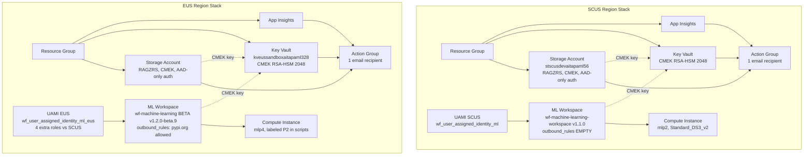
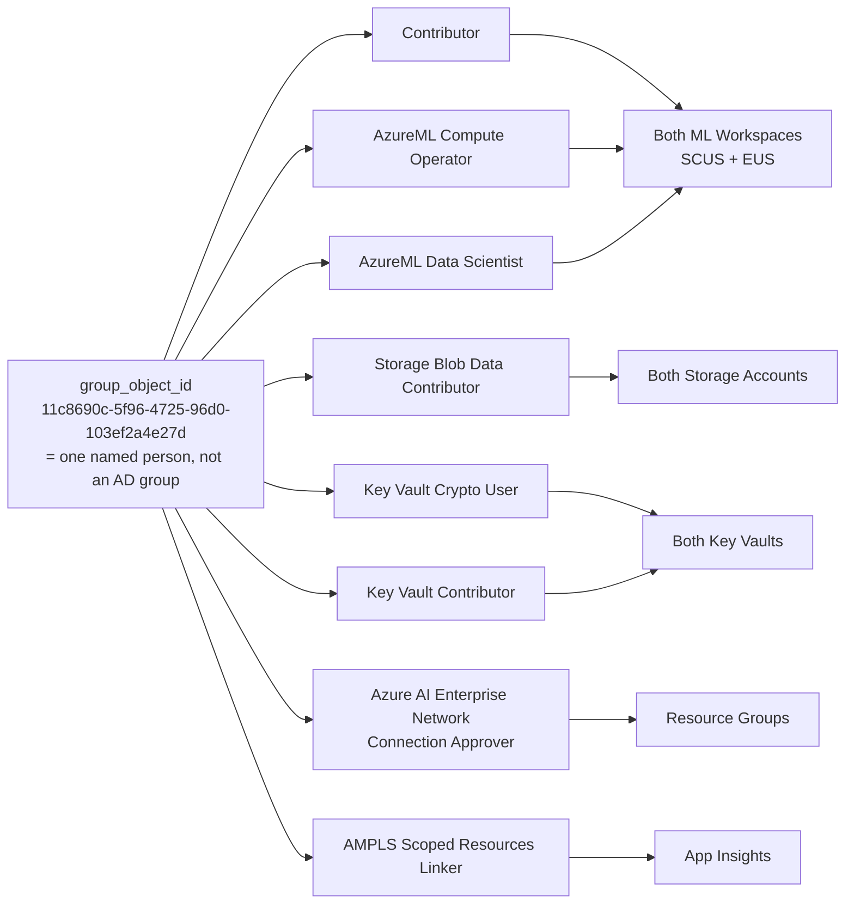
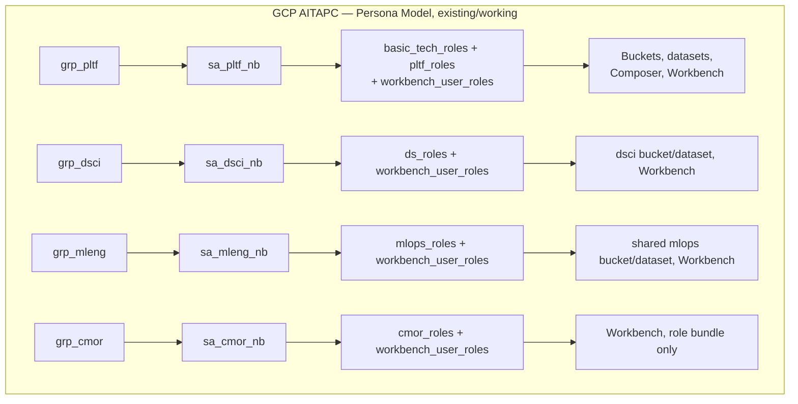
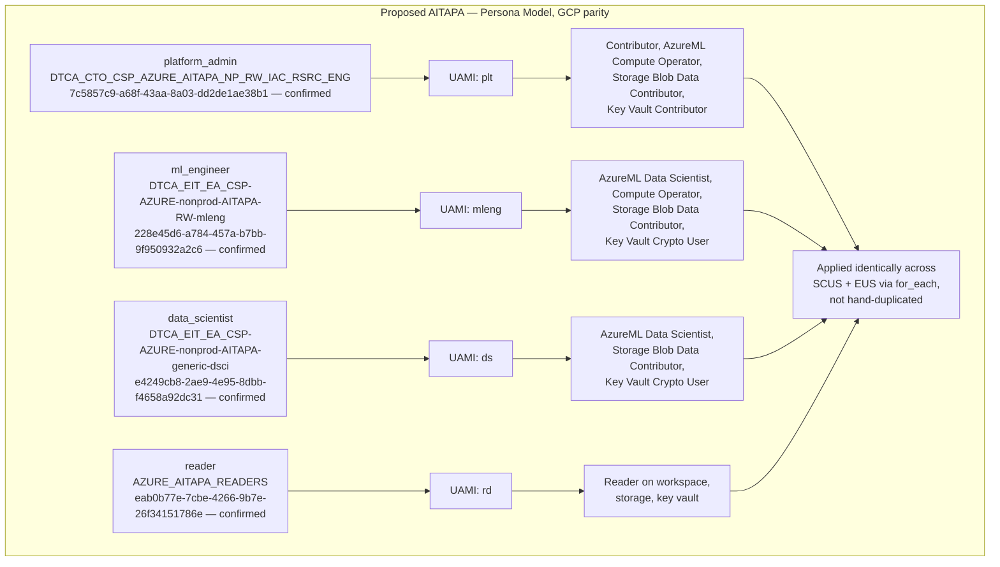

# AITAPA Terraform Architecture Review & GCP-Parity RBAC Plan

**Notion page:** https://app.notion.com/p/3b57a5e7c4ee81baa3caf6938e1913be

Built 2026-08-07 from a full read of the "AITAPA .tf" Notion page (10 concatenated files: `app_insights.tf`, `key_vault.tf`, `main.tf`, `ml-work-inst-eus.tf`, `ml-work-inst.tf`, `provider.tf`, `role_assgn.tf`, `sdlc-local.tf`, `storage.tf`, `variables.tf`). This is prep material for finalizing the AITAPA roles/RBAC work ahead of Deepak's call.

## 1. Current Architecture — What's Set Up Now

**Correction (08/07, from user):** EUS is not a deliberate dual-region design — it exists because SCUS hit a capacity limit while holding a workspace in soft-delete, and EUS was stood up as an overflow. There is currently no ongoing need for two regions in parallel. This changes how Section 2A below should be read: the SCUS/EUS asymmetry is still worth cleaning up while EUS is in use, but "parameterize for multi-region" is not a real architectural requirement right now — see the revised note in 2A.

Two regional stacks (SCUS and EUS — EUS as a capacity-overflow instance, not a designed second region), each independently hand-built rather than parameterized from one module: Resource Group → Storage Account (CMEK) → Key Vault (CMEK) → App Insights + Action Group (alerting scaffolded but empty) → ML Workspace (CMEK, network-isolated) → Compute Instance, plus one region-scoped UAMI per region.



### 1.1 Current RBAC model — a single flat identity, not personas

There is no persona abstraction today. One "group_object_id" — actually the hardcoded object ID of one named individual (`11c8690c-5f96-4725-96d0-103ef2a4e27d`, commented `#Varsha.G@wellsfargo.com`, flagged inline `#Need to add PVR`) — holds nearly every role on nearly every resource, in both regions.



The two UAMIs (one per region) are workspace-level service identities, not persona identities — and they're asymmetric: the EUS UAMI carries 4 extra roles (`Key Vault Contributor`, `Key Vault Administrator`, and PE-approver on both storage and the workspace) that the SCUS UAMI lacks.

### 1.2 Regional asymmetry — SCUS vs EUS drifted apart

| Aspect | SCUS | EUS |
|---|---|---|
| ML workspace module | `wf-machine-learning-workspace/azurerm ~>1.1.0` | `wf-machine-learning/azurerm//modules/aml-workspace` **beta v1.2.0-beta.9** |
| Outbound rules | `{}` — empty (PyPI installs likely fail) | Explicit `pypi.org` + `files.pythonhosted.org` allowed |
| Subnet ID source | `local.sdlc_config.scus.subnet_id_pe` (proper local) | Hardcoded literal string, repeated 3× verbatim |
| UAMI role bundle | 4 roles | 4 roles + `Key Vault Contributor`, `Key Vault Administrator`, 2× PE-approver |
| `env` value | Hardcoded `"sandbox"` literal in 3 places | Uses `local.env` |
| `soft_delete_enabled` | Not set | Explicitly `true` |
| Compute instance `depends_on` | None (likely missing dependency) | Has one on PE-approver role assignment |

### 1.3 SDLC levels — only 2 of 4 actually work

`sdlc_group_configs` has 4 entries (`dev`, `test`, `prod`, `sandbox`), but only `dev` and `sandbox` are fully built (subnet blocks, `group_object_id`). `test` and `prod` are stub entries missing `group_object_id` and the `scus`/`eus` subnet blocks entirely — **selecting `var.sdlc_level = "prod"` today would fail** with a missing-attribute error the first time `local.sdlc_config.scus.subnet_id_pe` or `.group_object_id` is dereferenced.

## 2. What Can Be Better — Code Quality & Efficiency

### A. Region duplication — revised given EUS's actual origin
**Correction:** EUS wasn't a designed second region — it was stood up as a capacity-overflow instance after SCUS hit a limit holding a workspace in soft-delete. There's no current requirement to run two regions in parallel long-term, so "parameterize both regions via `for_each`" is not really the right fix to prioritize.

What this changes: the SCUS/EUS drift table above (different module versions, asymmetric UAMI roles, `outbound_rules` gap) still matters *while EUS is in active use*, since a broken/inconsistent overflow instance is still a real operational risk. But the better long-term question is **whether EUS is still needed at all** — once the SCUS soft-delete/capacity issue is resolved (see the "200 OK"/soft-delete blocker tracked separately), it may be worth consolidating back to SCUS-only and decommissioning EUS, rather than investing in permanent dual-region parameterization. Worth deciding this before sinking effort into region-parameterizing the persona/RBAC rework below.

### B. Hardcoded values that should be variables/locals
- `role = "az-aitapa-dev"` in `data.vault_azure_access_credentials.this` — comment shows the intended `local.sdlc_config.vault_role` was abandoned.
- EUS subnet ID hardcoded 3× instead of a local.
- The 6 storage allow-list IPs hardcoded inline in 2 places *in addition to* existing as `local.ip_rules_storage`.
- `env = "sandbox"` hardcoded literal (3 occurrences) instead of `local.env`.
- AMPLS provider's `subscription_id = "8e200116-d6c1-4fff-be9c-4dd8c5650417"` — no local, no variable, and it's a **different subscription** than everything else in the file (`0dc6482e-...`). Worth confirming with the platform team whether this is intentional.
- `user_object_id = "11c8690c-5f96-4725-96d0-103ef2a4e27d"` hardcoded twice instead of derived from `local.sdlc_config.group_object_id`.

### C. Dead/unused locals and commented-out code
- `nsg_priority_eus`, `rnd_suffix_length` — defined, never referenced anywhere.
- `region_code_scus` — exact duplicate of `region_code`.
- `#for_each = local.aitapa_instances_scus_maps` appears twice in `role_assgn.tf` — references a local that **does not exist anywhere in the codebase**. This is the one visible trace of an intended data-driven pattern that was never finished.
- Multiple commented-out blocks left in place rather than removed: `#subnet_id_compute`, `#dns_zone_id`, `#enable_https_traffic_only`, a commented-out `containers = { bootstrap = {...} }` block, `#identity_type = "UserAssigned"`, and a dead reference to `local.aitapa_nsg_priority_scus` (which doesn't exist — only `nsg_priority_eus` does) inside commented-out NSG rule code.

### D. Naming inconsistencies / typos
- `wf_role_assignment_scus_aitpa_ampls_scoped_resource_linker` — typo, missing the second "a" in "aitapa".
- SCUS role-assignment modules mix prefixed (`wf_role_assignment_scus_aitapa_*`) and unprefixed (`wf_role_assignment_ml_storage`, `wf_role_assignment_ml_kv`, `wf_role_assignment_ml`) naming for logically equivalent things; EUS is consistently prefixed.
- EUS compute instance: `additional_name="mlp4"` but `description="AITAPA ML Compute Instance P2"` — doesn't match the workspace's own "P1" labeling, and its `creation_script`/`startup_script` still echo `"AITAPA p2 compute instance created"` — a copy-paste artifact from the SCUS block that was never updated.
- Two locals for the same region: `region_code` and `region_code_scus`, both `"scus"`.

### E. Module version drift
Most `wf-role-assignment/azurerm` calls pin `~>3.4.1`, but three specific ones (`scus_aitapa_key_vault_contributor`, `scus_aitpa_ampls_scoped_resource_linker`, `eus_aitapa_key_vault_contributor`) pin the older `~>3.3.0` with no evident reason. The `azapi` provider is pinned to an exact version (`2.7.0`) while every other provider uses `~>` — inconsistent pinning style, and no `azapi_*` resource is even visible in the root module (possibly used transitively inside a module source).

### F. RBAC model gaps
- No real AD group exists yet for "the group" — it's one person's object ID standing in, flagged with an unresolved `#Need to add PVR` TODO comment (appears twice).
- `vault_role` is hardcoded to `"az-aitapa-dev"` in 3 of the 4 SDLC-level configs (`sandbox`, `test`, `prod` all say "-dev") — credential issuance isn't actually environment-scoped despite `sdlc_level` existing to select between environments.
- `Key Vault Administrator` **and** `Key Vault Contributor` are both granted to the EUS UAMI — Administrator is a superset of Contributor, so this is redundant, unnecessarily broad access for a workload identity.

### G. Alerting scaffolding without actual alerts
All 6 `wf-pscobserv-core` alert-wrapper modules (Key Vault ×2, storage ×2) have empty `metric_alerts = {}` and `query_alerts = {}` — the action-group wiring exists, but zero actual alert rules/thresholds are defined anywhere. Alerts also route to a single personal mailbox, not a team distribution list.

### H. Other notable issues
- SCUS ML workspace runs `network_isolation_mode = "AllowOnlyApprovedOutbound"` with `outbound_rules = {}` — under strict outbound isolation with zero approved FQDN rules, standard `pip install` from PyPI would likely fail on SCUS (this is a plausible root cause worth checking against any SCUS package-install issues).
- The `ip_rules_keyvault` list (~200+ CIDRs) has several internal duplicate entries never cleaned up.
- Two `import { to = ...; id = ... }` blocks are left permanently in `storage.tf` rather than removed after the one-time import — unusual and can confuse future plan/apply reviews about whether they're still "pending."

## 3. GCP AITAPC Persona Model (Reference Pattern)

The existing GCP side already does what AITAPA needs to mirror:



One AD group per persona, one service account per persona, a defined role bundle per persona, applied consistently.

## 4. Proposed AITAPA Target State — Persona-Based RBAC (GCP Parity)



### 4.1 Persona-to-group mapping — what's actually confirmed (from the "AITAPA roles" page)

| Persona | Candidate AD group | Object GUID | Status |
|---|---|---|---|
| platform_admin | `DTCA_CTO_CSP_AZURE_AITAPA_NP_RW_IAC_RSRC_ENG` | `7c5857c9-a68f-43aa-8a03-dd2de1ae38b1` | **Confirmed** — real GUID, matches "platform foundation engineers" |
| ml_engineer | `DTCA_EIT_EA_CSP-AZURE-nonprod-AITAPA-RW-mleng` | `228e45d6-a784-457a-b7bb-9f950932a2c6` | **Confirmed** — real GUID, matches by name |
| data_scientist | `DTCA_EIT_EA_CSP-AZURE-nonprod-AITAPA-generic-dsci` | `e4249cb8-2ae9-4e95-8dbb-f4658a92dc31` | **Confirmed** — real GUID, matches by name |
| reader | `AZURE_AITAPA_READERS` | `eab0b77e-7cbe-4266-9b7e-26f34151786e` | **Confirmed 08/07** — user pulled this directly from the Azure console; matches Copilot's earlier claim, now independently verified |

Also on that page, in a separate disconnected table: `DOE.Developer.AITAPA` → `b26e2074-11ff-43b6-9070-63c585cb7f6b` — unclear whether/how this factors into the 4-persona model; flagged in the original roles review and still unresolved.

This directly reuses the role bundles already worked out on the "AITAPA roles" page (both my critique and Copilot's later response converged on the same 4-persona role table shown in the diagram above) — the gap was that none of the underlying Terraform scaffolding existed yet in the actual `.tf` files reviewed here; the reader-persona GUID is now resolved (see 4.1) and the persona map itself has since been added locally (steps 2–4 below).

## 5. Migration Plan — Step by Step

1. ~~Confirm the one remaining persona GUID~~ **Done (08/07)** — all 4 persona GUIDs are now confirmed real (see 4.1 table). Reader = `AZURE_AITAPA_READERS` = `eab0b77e-7cbe-4266-9b7e-26f34151786e`, verified directly from the Azure console. Old principal `11c8690c-...` disposition also decided: **fold into `platform_admin`** (not a separate safety-patch case — see step 9 update below).
2. **Define a `locals.personas` map** mirroring the GCP pattern: persona key → `{ group_object_id, uami_suffix, workspace_roles, storage_roles, kv_roles }`. All 4 GUIDs are confirmed, so this can be written now:

```hcl
locals {
  personas = {
    platform_admin = {
      group_object_id = "7c5857c9-a68f-43aa-8a03-dd2de1ae38b1" # DTCA_CTO_CSP_AZURE_AITAPA_NP_RW_IAC_RSRC_ENG
      uami_suffix      = "plt"
      workspace_roles  = ["Contributor", "AzureML Compute Operator"]
      storage_roles    = ["Storage Blob Data Contributor"]
      kv_roles         = ["Key Vault Contributor"]
    }
    ml_engineer = {
      group_object_id = "228e45d6-a784-457a-b7bb-9f950932a2c6" # DTCA_EIT_EA_CSP-AZURE-nonprod-AITAPA-RW-mleng
      uami_suffix      = "mleng"
      workspace_roles  = ["AzureML Data Scientist", "AzureML Compute Operator"]
      storage_roles    = ["Storage Blob Data Contributor"]
      kv_roles         = ["Key Vault Crypto User"]
    }
    data_scientist = {
      group_object_id = "e4249cb8-2ae9-4e95-8dbb-f4658a92dc31" # DTCA_EIT_EA_CSP-AZURE-nonprod-AITAPA-generic-dsci
      uami_suffix      = "ds"
      workspace_roles  = ["AzureML Data Scientist"]
      storage_roles    = ["Storage Blob Data Contributor"]
      kv_roles         = ["Key Vault Crypto User"]
    }
    reader = {
      group_object_id = "eab0b77e-7cbe-4266-9b7e-26f34151786e" # AZURE_AITAPA_READERS
      uami_suffix      = "rd"
      workspace_roles  = ["Reader"]
      storage_roles    = ["Reader"]
      kv_roles         = ["Reader"]
    }
  }
}
```

Design notes: keyed by persona name (not a list) so `for_each` gets stable resource addresses — reordering entries won't cause Terraform to destroy/recreate anything, unlike `count`. Roles are split into three lists (`workspace_roles`/`storage_roles`/`kv_roles`) rather than one flat list because each targets a different `scope` in the eventual `azurerm_role_assignment` — workspace roles scope to the ML workspace, storage roles to the storage account, kv roles to the key vault. `uami_suffix` feeds the UAMI's `additional_name` in step 3, keeping naming consistent with the existing module convention. The map itself is region-agnostic — it gets consumed once per region in steps 3/4, so it doesn't need scus/eus duplication.

**Service-account parity (08/07):** the Azure equivalent of a GCP service account is the **UAMI** (User-Assigned Managed Identity) — one per persona, same as GCP's one-SA-per-persona pattern. `uami_suffix` values above (`plt`, `mleng`, `ds`, `rd`) match the actual GCP abbreviation convention (corrected from the earlier `pltf`/`dsci`/`read` guesses, which were based on the longer `grp_*`/`sa_*_nb` names documented on the "AITAPA roles" page — those are the full AD group / SA names, not the short suffix convention). So the mapping is: GCP `sa-plt-nb` ↔ Azure `uami-plt`, `sa-mleng-nb` ↔ `uami-mleng`, `sa-ds-nb` ↔ `uami-ds`, and the reader persona (`rd`) ↔ `uami-rd`.
**Additional roles from Harsha (08/07) — pending persona-mapping confirmation.** She sent over a fuller role bundle, split into two categories (this matches the richer UAMI bundle already noted in her POC comparison, Section 7):

**UAMI Roles** (the workload/service identity attached to the workspace and compute):
- Key Vault Crypto Officer — Key Vault
- Key Vault Crypto Service Encryption User — Key Vault
- Reader — Key Vault
- Storage Contributor — Storage Account
- Storage Blob Data Contributor — Storage Account
- Storage File Data Privileged Contributor — Storage Account
- Reader — Storage Account
- Reader — Storage Account Private Endpoint (scope pattern: `/subscriptions/${local.subscription_id}/resourceGroups/${module.wf_resource_group.name}/providers/Microsoft.Network/privateEndpoints/pe-${local.region_code}-${var.sdlc_level}-${local.base_name}-${local.additional_name}-${module.wf_storage_account.random_suffix}-st-bl` — adapt to your actual variable/module names)
- Azure AI Enterprise Network Connection Approver — Storage Account
- Reader — ML Workspace Private Endpoint (`module.wf_machine_learning.private_endpoint_id`)

**User Roles** (persona/AD group access for humans using the workspace directly):
- Key Vault Crypto Officer — Key Vault
- Key Vault Crypto Service Encryption User — Key Vault
- Reader — Key Vault
- AMPLS Scoped Resources Linker - wf2 — Application Insights
- Storage Blob Data Contributor — Storage Account
- AzureML Data Scientist — ML Workspace

**My proposed mapping (needs your confirmation before locking into code):**
- "UAMI Roles" → apply to `platform_admin`'s UAMI, since it's already the persona selected as the workspace's system identity (per the existing "workspace identity selector" design note).
- "User Roles" → reads as scoped to the personas that actively build/run models — proposing `ml_engineer` and `data_scientist`, not `platform_admin` or `reader`. **Confirm this is right**, or tell me if it should apply differently (e.g. all 4 personas, or just one).

Updated `locals.personas` incorporating this (additions marked, pending your confirmation on the mapping above):

```hcl
locals {
  personas = {
    platform_admin = {
      group_object_id = "7c5857c9-a68f-43aa-8a03-dd2de1ae38b1" # DTCA_CTO_CSP_AZURE_AITAPA_NP_RW_IAC_RSRC_ENG
      uami_suffix      = "plt"
      workspace_roles  = ["Contributor", "AzureML Compute Operator"]
      storage_roles    = [
        "Storage Blob Data Contributor",
        "Storage Contributor",                              # NEW from Harsha (UAMI Roles) — pending confirmation
        "Storage File Data Privileged Contributor",          # NEW from Harsha (UAMI Roles) — pending confirmation
        "Reader",                                            # NEW from Harsha (UAMI Roles) — pending confirmation
        "Azure AI Enterprise Network Connection Approver",   # NEW from Harsha (UAMI Roles) — pending confirmation
      ]
      kv_roles = [
        "Key Vault Contributor",
        "Key Vault Crypto Officer",                          # NEW from Harsha (UAMI Roles) — pending confirmation
        "Key Vault Crypto Service Encryption User",          # NEW from Harsha (UAMI Roles) — pending confirmation
        "Reader",                                            # NEW from Harsha (UAMI Roles) — pending confirmation
      ]
      # NEW from Harsha (UAMI Roles) — pending confirmation: Reader on the storage-account PE and on the ML workspace PE.
      # These scope to specific sub-resources (private endpoint IDs), not the whole storage account/workspace,
      # so they'll need their own role_assignment blocks in step 4 rather than living in these flat lists.
    }
    ml_engineer = {
      group_object_id = "228e45d6-a784-457a-b7bb-9f950932a2c6" # DTCA_EIT_EA_CSP-AZURE-nonprod-AITAPA-RW-mleng
      uami_suffix      = "mleng"
      workspace_roles  = ["AzureML Data Scientist", "AzureML Compute Operator"]
      storage_roles    = ["Storage Blob Data Contributor"]
      kv_roles         = [
        "Key Vault Crypto Officer",                          # UPDATED from Harsha (User Roles) — pending confirmation
        "Key Vault Crypto Service Encryption User",          # NEW from Harsha (User Roles) — pending confirmation
        "Reader",                                            # NEW from Harsha (User Roles) — pending confirmation
      ]
      # NEW from Harsha (User Roles) — pending confirmation: AMPLS Scoped Resources Linker - wf2, scoped to App Insights.
    }
    data_scientist = {
      group_object_id = "e4249cb8-2ae9-4e95-8dbb-f4658a92dc31" # DTCA_EIT_EA_CSP-AZURE-nonprod-AITAPA-generic-dsci
      uami_suffix      = "ds"
      workspace_roles  = ["AzureML Data Scientist"]
      storage_roles    = ["Storage Blob Data Contributor"]
      kv_roles         = [
        "Key Vault Crypto Officer",                          # UPDATED from Harsha (User Roles) — pending confirmation
        "Key Vault Crypto Service Encryption User",          # NEW from Harsha (User Roles) — pending confirmation
        "Reader",                                            # NEW from Harsha (User Roles) — pending confirmation
      ]
      # NEW from Harsha (User Roles) — pending confirmation: AMPLS Scoped Resources Linker - wf2, scoped to App Insights.
    }
    reader = {
      group_object_id = "eab0b77e-7cbe-4266-9b7e-26f34151786e" # AZURE_AITAPA_READERS
      uami_suffix      = "rd"
      workspace_roles  = ["Reader"]
      storage_roles    = ["Reader"]
      kv_roles         = ["Reader"]
    }
  }
}
```

3. **Replace the two region-keyed UAMIs** (`wf_user_assigned_identity_ml`, `wf_user_assigned_identity_ml_eus`) with a single `for_each = local.personas` UAMI module, one identity per persona (not per region) — matching the GCP one-SA-per-persona model.

```hcl
# Replaces module.wf_user_assigned_identity_ml (SCUS)
module "wf_user_assigned_identity_scus" {
  source   = "localterraform.com/TFE-MSAC-shared/wf-user-assigned-identity/azurerm"
  version  = "~>3.1.0"
  for_each = local.personas

  additional_name   = "${local.additional_name}-${each.value.uami_suffix}"
  base_name         = local.base_name
  env               = var.sdlc_level
  region_code       = local.region_code_scus
  rnd_suffix_length = 0
  tags              = local.sdlc_config.tags

  resource_group_name = module.wf_resource_group_scus_aitapa_aisvc_001.name
}

# Mirrors for EUS while it's still in use (step 5 below — EUS's fate is still open)
module "wf_user_assigned_identity_eus" {
  source   = "localterraform.com/TFE-MSAC-shared/wf-user-assigned-identity/azurerm"
  version  = "~>3.1.0"
  for_each = local.personas

  additional_name   = "${local.additional_name}-${each.value.uami_suffix}"
  base_name         = local.base_name
  env               = var.sdlc_level
  region_code       = local.region_code_eus
  rnd_suffix_length = 0
  tags              = local.sdlc_config.tags

  resource_group_name = module.wf_resource_group_eus_aitapa_aisvc_001.name
}
```

Then rewire the workspace/compute identity references — per the existing design note (workspace identity = `platform_admin`, compute identity = `ml_engineer`):

```hcl
# ML workspace module:
user_assigned_identity_ids = [module.wf_user_assigned_identity_scus["platform_admin"].id]

# Compute instance module:
user_assigned_identity_ids = [module.wf_user_assigned_identity_scus["ml_engineer"].id]
```

Delete the old singleton `wf_user_assigned_identity_ml` / `wf_user_assigned_identity_ml_eus` blocks and any other reference to them once this is wired in.

4. **Replace the ~30 individually copy-pasted `wf_role_assignment_*` blocks** with `for_each`-driven modules keyed by persona × role × region — this also finally implements the pattern the dead `#for_each = local.aitapa_instances_scus_maps` comment was reaching for.

**Design call to make first:** each persona's role lists get assigned to *both* the AD group (human access) *and* that persona's UAMI (service access) — same bundle, two principals. That's the simplest read of the current map; if the UAMI needs a narrower/different set than the group, the map would need to split into separate `group_roles`/`uami_roles` lists instead. Flag if that split is wanted — otherwise:

```hcl
locals {
  aml_workspace_role_assignments = merge([
    for persona_key, persona in local.personas : merge(
      { for role in persona.workspace_roles : "${persona_key}-group-${role}" => {
          principal_id = persona.group_object_id
          role         = role
      }},
      { for role in persona.workspace_roles : "${persona_key}-uami-${role}" => {
          principal_id = module.wf_user_assigned_identity_scus[persona_key].principal_id
          role         = role
      }}
    )
  ]...)

  aml_storage_role_assignments = merge([
    for persona_key, persona in local.personas : merge(
      { for role in persona.storage_roles : "${persona_key}-group-${role}" => {
          principal_id = persona.group_object_id
          role         = role
      }},
      { for role in persona.storage_roles : "${persona_key}-uami-${role}" => {
          principal_id = module.wf_user_assigned_identity_scus[persona_key].principal_id
          role         = role
      }}
    )
  ]...)

  aml_key_vault_role_assignments = merge([
    for persona_key, persona in local.personas : merge(
      { for role in persona.kv_roles : "${persona_key}-group-${role}" => {
          principal_id = persona.group_object_id
          role         = role
      }},
      { for role in persona.kv_roles : "${persona_key}-uami-${role}" => {
          principal_id = module.wf_user_assigned_identity_scus[persona_key].principal_id
          role         = role
      }}
    )
  ]...)
}

module "wf_role_assignment_scus_workspace" {
  source   = "localterraform.com/TFE-MSAC-shared/wf-role-assignment/azurerm"
  version  = "~>3.4.1"
  for_each = local.aml_workspace_role_assignments

  azuread_object_id      = each.value.principal_id
  azuread_principal_type = "objectid"
  role_definition_name   = each.value.role
  scope                  = module.wf_machine_learning_scus_aitapa.id
}

module "wf_role_assignment_scus_storage" {
  source   = "localterraform.com/TFE-MSAC-shared/wf-role-assignment/azurerm"
  version  = "~>3.4.1"
  for_each = local.aml_storage_role_assignments

  azuread_object_id      = each.value.principal_id
  azuread_principal_type = "objectid"
  role_definition_name   = each.value.role
  scope                  = module.wf_storage_account_scus_dev_aitapa.id
}

module "wf_role_assignment_scus_kv" {
  source   = "localterraform.com/TFE-MSAC-shared/wf-role-assignment/azurerm"
  version  = "~>3.4.1"
  for_each = local.aml_key_vault_role_assignments

  azuread_object_id      = each.value.principal_id
  azuread_principal_type = "objectid"
  role_definition_name   = each.value.role
  scope                  = module.wf_key_vault_scus_dev_aitapa_keyvault.id
}
```

Mirror the same three blocks for EUS (swap the `scus` region references for `eus`). The two PE-scoped Reader roles from Harsha's list (storage-account PE, workspace PE) don't fit this flat pattern — they need their own one-off `role_assignment` blocks scoped to the specific private-endpoint ID, same as noted in the persona map comment in step 2.

Once this is wired in, delete the ~30 old individual `wf_role_assignment_*` blocks across `role_assgn.tf` and `ml-work-inst-eus.tf` — that's what actually retires the dead `#for_each = local.aitapa_instances_scus_maps` pattern.
5. **Decide EUS's fate before reconciling it** — since EUS only exists as a SCUS capacity-overflow instance, confirm whether it's still needed once the SCUS soft-delete/capacity issue clears. If EUS stays in use, reconcile its asymmetries with SCUS (same ML workspace module family/version, same `outbound_rules`, same UAMI role bundle shape, same subnet-ID sourcing pattern). If not, plan its decommission instead of investing in parity work for it.
6. **Fold in the cleanup items from Section 2** opportunistically as each file is touched — don't do it as a separate pass, since most of it (locals, hardcoded values, dead code) lives in the same files being rewritten anyway.
7. **Fill in the `test`/`prod` SDLC stubs** (`group_object_id`, `scus`/`eus` subnet blocks, correct `vault_role` per environment) so those levels stop being non-functional.
8. **Get an authenticated `terraform init && terraform plan` run** — this has been blocked by a 401 against the `localterraform.com` module registry in every prior attempt; nothing above should be applied without seeing a real plan diff.
9. ~~Apply Copilot's offered "safety patch" pattern~~ **Decided (08/07):** `11c8690c-...` folds into `platform_admin` — whoever needed that access should be (or become) a member of `DTCA_CTO_CSP_AZURE_AITAPA_NP_RW_IAC_RSRC_ENG`. No parallel legacy-RBAC patch needed; still worth double-checking the actual person(s) behind `11c8690c-...` are in that group before applying, so access genuinely carries over rather than just being reassigned on paper.
10. **Document the final decisions directly in code** — a short comment block recording the TFE/Vault exclusion decision and the final role-bundle table, for future traceability (per Copilot's own suggestion in the earlier review).

### 5.1 Sandbox test round (08/07) — push roles, temporarily isolate CMEK

Immediate plan for this sandbox pass, per user direction: CMEK gets **temporarily decoupled, not permanently removed** — it was specifically what closed a Prisma alert (the non-CMEK workspace was flagged as a vulnerability; see the 08/07 MOM), so this needs to go back in afterward, not get forgotten.

1. Get past `terraform init` (401 on the module registry) — still the hard blocker before anything below can run.
2. **Comment out** (don't delete) the CMEK arguments on the ML workspace module block(s) being tested: `cmek_enabled`, `cmek_key_vault_id`, `cmek_key_id`, `cmek_storage_account_id`, `enable_service_side_cmk_encryption`. Leave the `azurerm_key_vault_key` + `time_offset` CMEK key resources themselves untouched in the file — they stay in state, ready to re-link, so this is a quick revert later rather than rebuilding the key from scratch.
3. Push the persona RBAC changes (steps 2–4 above: `locals.personas`, the `for_each` UAMI, the `for_each` role assignments) into the actual `.tf` files.
4. Run `terraform plan` and actually read the diff — check specifically that (a) the CMEK-related attributes show as removed/no-op as expected and nothing else unexpected changes on the workspace, (b) the persona role assignments show as new adds, not unexpected destroys elsewhere.
5. Apply in sandbox, then test: confirm the workspace comes up, the compute instance still works, and each persona's UAMI has the access it's supposed to.
6. **Follow-up, don't skip:** once the persona-role test is validated, re-enable the CMEK arguments (uncomment) and re-apply, so the workspace goes back to being CMEK-compliant before this goes anywhere near being called "done." Track this explicitly so it doesn't quietly get left off.

## 6. Open Questions / Inputs Needed From You

- ~~Real AD group object IDs for all 4 personas~~ **Done (08/07) — all 4 confirmed** (see 4.1). Reader = `AZURE_AITAPA_READERS` = `eab0b77e-7cbe-4266-9b7e-26f34151786e`, verified from the Azure console.
- ~~Should SCUS and EUS be unified...~~ **Answered:** EUS is a capacity-overflow instance (SCUS hit a limit holding a workspace in soft-delete), not a designed second region. Follow-up: once SCUS's soft-delete/capacity issue is resolved, should EUS be decommissioned rather than kept in parity?
- ~~What should happen to `group_object_id = 11c8690c-...`~~ **Answered (08/07): fold into `platform_admin`.**
- **New (08/07):** confirm the Harsha role-bundle → persona mapping proposed in step 2 (UAMI Roles → `platform_admin`; User Roles → `ml_engineer` + `data_scientist`).
- **New (08/07):** confirm the step 4 design call — same role bundle applied to both a persona's AD group and its UAMI, or split into separate `group_roles`/`uami_roles` lists?
- Priority: should the persona migration happen first and cleanup follow, or should the Section 2 cleanup items be fixed as a precursor?
- Adopt Harsha's `for_each`-over-an-instance-map pattern (Section 7) as the mechanical basis for the persona `for_each` work in Section 5?

## 7. Comparison Against Harsha's POC ("harsha poc" Notion page)

Her file is an explicit POC/test rig (instance named `hs02`/`ml3`, local module source paths pointing at `./modules/...` instead of the registry, resources literally described as "Test Azure ML workspace" / "Test Compute Instance") — built to trial new module capabilities, not a persona-RBAC reference. Still useful for structural comparison.

### What her POC has that your current AITAPA setup doesn't

1. **Fully parameterized, `for_each`-over-an-instance-map pattern** — one `hs02_instance_names_scus = "ml3"` string drives everything (comma-separated list → parsed into a map → `for_each` across ~15 resource types: role assignments, UAMI, App Insights, ACR, ML workspace, feature store, compute instance, datastore, batch endpoint, registry). Add or remove an ML instance by editing one line; nothing is hand-duplicated. Your setup has two entirely separate, hand-written region blocks with no instance abstraction — this is exactly the pattern the dead `#for_each = local.aitapa_instances_scus_maps` comment in your `role_assgn.tf` appears to have been reaching for and never finished.
2. **Real alert rules** — her `wf-pscobserv-aiml` module populates ~25 actual `metric_alerts` (`cpu_utilization`, `failed_runs`, `model_deploy_failed`, `storage_api_failure_count`, etc.) and ~9 `query_alerts`. Every alert module in your setup has `metric_alerts = {}` / `query_alerts = {}` — the wiring exists, nothing fires.
3. **A broader `outbound_rules` set** — PyPI, Anaconda, `raw.githubusercontent.com`, storage blob FQDN, KV private endpoint, storage private endpoint, and a storage ServiceTag rule. Your EUS workspace only allows PyPI + pythonhosted.org; your SCUS workspace allows nothing.
4. **Extra ML capabilities not present in your files at all**: Feature Store, Datastore (blob), Batch Endpoint, ML Registry, and a dedicated Container Registry (ACR) with its own Key Vault + observability. If any of these are on your near-term roadmap, there's a working reference to build from.
5. **A "keep common resources on delete" toggle** (`hs02_keep_common_res_on_delete_scus`) — lets her tear down/recreate ML instances without losing the shared Key Vault/Storage Account. Your setup has no equivalent safety valve.
6. **A richer/more complete UAMI role bundle**: Key Vault Contributor + Administrator, Storage Blob Data Contributor, Storage File Data Privileged Contributor, two Reader grants (storage account + storage PE), Azure AI Enterprise Network Connection Approver, Azure AI Administrator, and a Reader on the workspace's own private endpoint. Your UAMIs (especially SCUS) have a narrower, and asymmetric-across-region, set.
7. **A separate `admins_group_object_id` local**, distinct from the per-instance service identity — a real (if still coarse) separation between "human admin access" and "service/workload identity access." Your setup uses the same single `group_object_id` (really one person's GUID) for both roles simultaneously.

### Where your setup is actually ahead of hers

- **CMEK is fully wired and active** on both your workspaces (`cmek_enabled`, `cmek_key_id`, `cmek_storage_account_id`, `enable_service_side_cmk_encryption`). In her POC, the CMEK key resource exists but every CMEK-related argument on the ML workspace block is commented out — CMEK is prepared but not actually turned on. Your CMEK implementation is more production-ready than hers.

### Where both files share the same anti-pattern

- Her compute instance also hardcodes a personal object ID as `user_object_id` (`8260e11d-...`, commented `#Harsha.Sahay@msgqa.wellsfargo.com`) rather than a group — so the "individual-GUID-standing-in-for-a-group" issue flagged in Section 2F isn't unique to your file; it's a pattern across at least two people's Terraform in this codebase. Worth raising as a team-wide convention gap, not just something to fix locally.
- Neither file implements a persona model (`platform_admin`/`ml_engineer`/`data_scientist`/`reader`). Her POC's two-tier admin-group + service-identity split is a step in that direction, but still isn't persona-based RBAC. The migration plan in Section 5 is still the right path; her POC doesn't have a shortcut for it, but its `for_each`-over-a-map pattern is exactly the mechanism to build that migration on top of.
