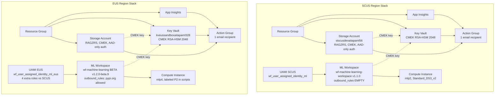
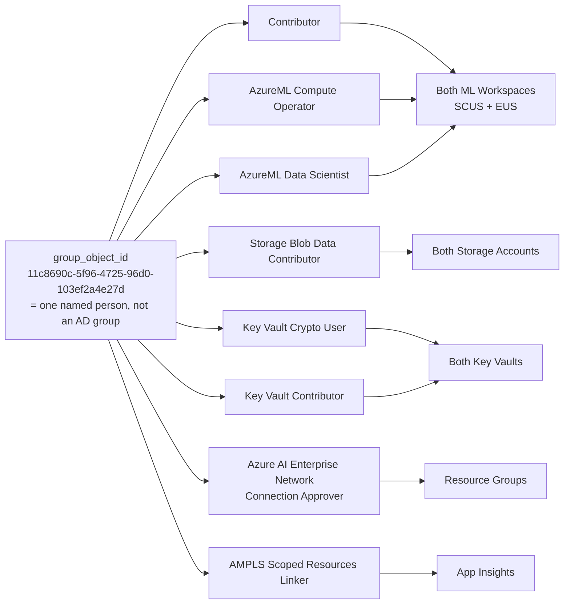
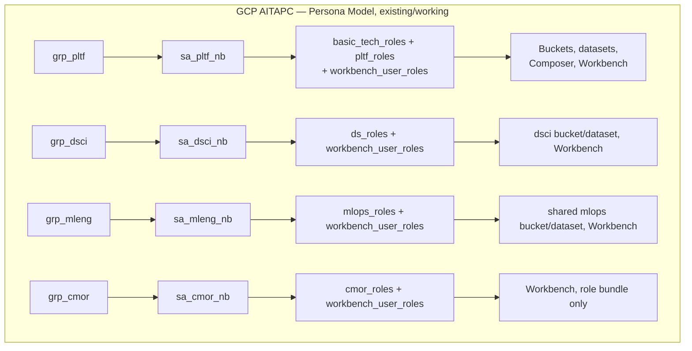
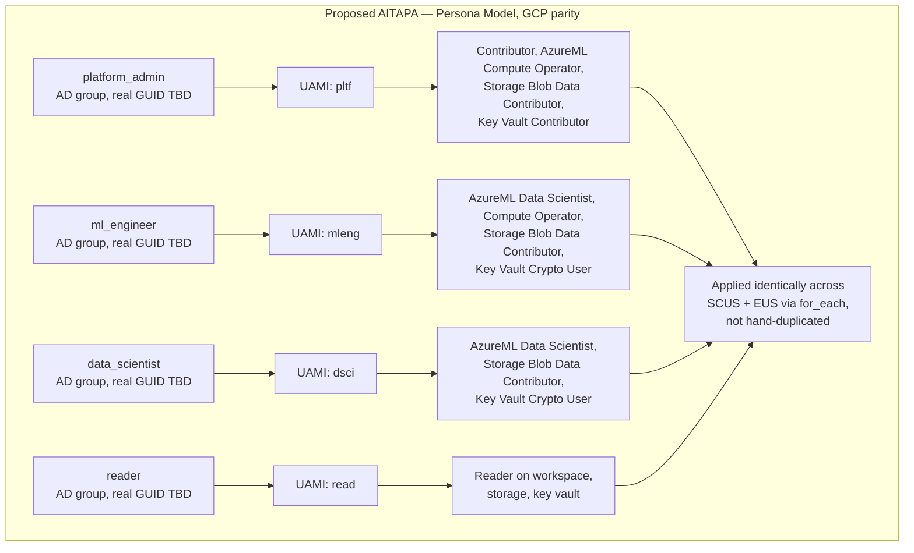

# AITAPA Terraform Architecture Review & GCP-Parity RBAC Plan

Built 2026-08-07 from a full read of the "AITAPA .tf" Notion page (10 concatenated files: `app_insights.tf`, `key_vault.tf`, `main.tf`, `ml-work-inst-eus.tf`, `ml-work-inst.tf`, `provider.tf`, `role_assgn.tf`, `sdlc-local.tf`, `storage.tf`, `variables.tf`). This is prep material for finalizing the AITAPA roles/RBAC work ahead of Deepak's call.

## 1. Current Architecture — What's Set Up Now

Two regional stacks (SCUS and EUS), each independently hand-built rather than parameterized from one module: Resource Group → Storage Account (CMEK) → Key Vault (CMEK) → App Insights + Action Group (alerting scaffolded but empty) → ML Workspace (CMEK, network-isolated) → Compute Instance, plus one region-scoped UAMI per region.

### 1.1 Current RBAC model — a single flat identity, not personas

There is no persona abstraction today. One "group_object_id" — actually the hardcoded object ID of one named individual (`11c8690c-5f96-4725-96d0-103ef2a4e27d`, commented `#Varsha.G@wellsfargo.com`, flagged inline `#Need to add PVR`) — holds nearly every role on nearly every resource, in both regions.

The two UAMIs (one per region) are workspace-level service identities, not persona identities — and they're asymmetric: the EUS UAMI carries 4 extra roles (`Key Vault Contributor`, `Key Vault Administrator`, and PE-approver on both storage and the workspace) that the SCUS UAMI lacks.

### 1.2 Regional asymmetry — SCUS vs EUS drifted apart

| Aspect | SCUS | EUS |
|---|---|---|
| ML workspace module | `wf-machine-learning-workspace/azurerm ~>1.1.0` | `wf-machine-learning/azurerm//modules/aml-workspace` **beta v1.2.0-beta.9** |
| Outbound rules | `{}` — empty (PyPI installs likely fail) | Explicit `pypi.org` + `files.pythonhosted.org` allowed |
| Subnet ID source | `local.sdlc_config.scus.subnet_id_pe` (proper local) | Hardcoded literal string, repeated 3× verbatim |
| UAMI role bundle | 4 roles | 4 roles + `Key Vault Contributor`, `Key Vault Administrator`, 2× PE-approver |
| `env` value | Hardcoded `"sandbox"` literal in 3 places | Uses `local.env` |
| `soft_delete_enabled` | Not set | Explicitly `true` |
| Compute instance `depends_on` | None (likely missing dependency) | Has one on PE-approver role assignment |

### 1.3 SDLC levels — only 2 of 4 actually work

`sdlc_group_configs` has 4 entries (`dev`, `test`, `prod`, `sandbox`), but only `dev` and `sandbox` are fully built (subnet blocks, `group_object_id`). `test` and `prod` are stub entries missing `group_object_id` and the `scus`/`eus` subnet blocks entirely — **selecting `var.sdlc_level = "prod"` today would fail** with a missing-attribute error the first time `local.sdlc_config.scus.subnet_id_pe` or `.group_object_id` is dereferenced.

## 2. What Can Be Better — Code Quality & Efficiency

### A. Region duplication instead of parameterization (the biggest structural issue)
The entire stack is hand-built twice (once per region) across `ml-work-inst.tf`/`role_assgn.tf`/`storage.tf`/`key_vault.tf`/`app_insights.tf` vs `ml-work-inst-eus.tf`, instead of one parameterized module or a `for_each` over `{scus, eus}`. This is the root cause of every drift item in the table above — the two stacks were edited independently and diverged. **Fix:** collapse into one module/stack definition parameterized by region, or at minimum a `for_each`-driven set of resources keyed by a `local.regions = ["scus", "eus"]` map so both regions are guaranteed to stay in sync.

### B. Hardcoded values that should be variables/locals
- `role = "az-aitapa-dev"` in `data.vault_azure_access_credentials.this` — comment shows the intended `local.sdlc_config.vault_role` was abandoned.
- EUS subnet ID hardcoded 3× instead of a local.
- The 6 storage allow-list IPs hardcoded inline in 2 places *in addition to* existing as `local.ip_rules_storage`.
- `env = "sandbox"` hardcoded literal (3 occurrences) instead of `local.env`.
- AMPLS provider's `subscription_id = "8e200116-d6c1-4fff-be9c-4dd8c5650417"` — no local, no variable, and it's a **different subscription** than everything else in the file (`0dc6482e-...`). Worth confirming with the platform team whether this is intentional.
- `user_object_id = "11c8690c-5f96-4725-96d0-103ef2a4e27d"` hardcoded twice instead of derived from `local.sdlc_config.group_object_id`.

### C. Dead/unused locals and commented-out code
- `nsg_priority_eus`, `rnd_suffix_length` — defined, never referenced anywhere.
- `region_code_scus` — exact duplicate of `region_code`.
- `#for_each = local.aitapa_instances_scus_maps` appears twice in `role_assgn.tf` — references a local that **does not exist anywhere in the codebase**. This is the one visible trace of an intended data-driven pattern that was never finished.
- Multiple commented-out blocks left in place rather than removed: `#subnet_id_compute`, `#dns_zone_id`, `#enable_https_traffic_only`, a commented-out `containers = { bootstrap = {...} }` block, `#identity_type = "UserAssigned"`, and a dead reference to `local.aitapa_nsg_priority_scus` (which doesn't exist — only `nsg_priority_eus` does) inside commented-out NSG rule code.

### D. Naming inconsistencies / typos
- `wf_role_assignment_scus_aitpa_ampls_scoped_resource_linker` — typo, missing the second "a" in "aitapa".
- SCUS role-assignment modules mix prefixed (`wf_role_assignment_scus_aitapa_*`) and unprefixed (`wf_role_assignment_ml_storage`, `wf_role_assignment_ml_kv`, `wf_role_assignment_ml`) naming for logically equivalent things; EUS is consistently prefixed.
- EUS compute instance: `additional_name="mlp4"` but `description="AITAPA ML Compute Instance P2"` — doesn't match the workspace's own "P1" labeling, and its `creation_script`/`startup_script` still echo `"AITAPA p2 compute instance created"` — a copy-paste artifact from the SCUS block that was never updated.
- Two locals for the same region: `region_code` and `region_code_scus`, both `"scus"`.

### E. Module version drift
Most `wf-role-assignment/azurerm` calls pin `~>3.4.1`, but three specific ones (`scus_aitapa_key_vault_contributor`, `scus_aitpa_ampls_scoped_resource_linker`, `eus_aitapa_key_vault_contributor`) pin the older `~>3.3.0` with no evident reason. The `azapi` provider is pinned to an exact version (`2.7.0`) while every other provider uses `~>` — inconsistent pinning style, and no `azapi_*` resource is even visible in the root module (possibly used transitively inside a module source).

### F. RBAC model gaps
- No real AD group exists yet for "the group" — it's one person's object ID standing in, flagged with an unresolved `#Need to add PVR` TODO comment (appears twice).
- `vault_role` is hardcoded to `"az-aitapa-dev"` in 3 of the 4 SDLC-level configs (`sandbox`, `test`, `prod` all say "-dev") — credential issuance isn't actually environment-scoped despite `sdlc_level` existing to select between environments.
- `Key Vault Administrator` **and** `Key Vault Contributor` are both granted to the EUS UAMI — Administrator is a superset of Contributor, so this is redundant, unnecessarily broad access for a workload identity.

### G. Alerting scaffolding without actual alerts
All 6 `wf-pscobserv-core` alert-wrapper modules (Key Vault ×2, storage ×2) have empty `metric_alerts = {}` and `query_alerts = {}` — the action-group wiring exists, but zero actual alert rules/thresholds are defined anywhere. Alerts also route to a single personal mailbox, not a team distribution list.

### H. Other notable issues
- SCUS ML workspace runs `network_isolation_mode = "AllowOnlyApprovedOutbound"` with `outbound_rules = {}` — under strict outbound isolation with zero approved FQDN rules, standard `pip install` from PyPI would likely fail on SCUS (this is a plausible root cause worth checking against any SCUS package-install issues).
- The `ip_rules_keyvault` list (~200+ CIDRs) has several internal duplicate entries never cleaned up.
- Two `import { to = ...; id = ... }` blocks are left permanently in `storage.tf` rather than removed after the one-time import — unusual and can confuse future plan/apply reviews about whether they're still "pending."

## 3. GCP AITAPC Persona Model (Reference Pattern)

The existing GCP side already does what AITAPA needs to mirror:

One AD group per persona, one service account per persona, a defined role bundle per persona, applied consistently.

## 4. Proposed AITAPA Target State — Persona-Based RBAC (GCP Parity)

This directly reuses the role bundles already worked out in the earlier "AITAPA roles" review (Platform Admin / ML Engineer / Data Scientist / Reader — see that page for the exact role list per persona) — the gap is that none of the underlying Terraform scaffolding exists yet in the actual `.tf` files reviewed here.

## 5. Migration Plan — Step by Step

1. **Get real AD group object IDs for all 4 personas** (`platform_admin`, `ml_engineer`, `data_scientist`, `reader`) — this is the same blocker already flagged in the "AITAPA roles" page review (the reader-persona GUID `eab0b77e-...` still needs its provenance confirmed). Nothing below can be built correctly without this.
2. **Define a `locals.personas` map** mirroring the GCP pattern: persona key → `{ group_object_id, uami_suffix, workspace_roles, storage_roles, kv_roles }`.
3. **Replace the two region-keyed UAMIs** (`wf_user_assigned_identity_ml`, `wf_user_assigned_identity_ml_eus`) with a single `for_each = local.personas` UAMI module, one identity per persona (not per region) — matching the GCP one-SA-per-persona model.
4. **Replace the ~30 individually copy-pasted `wf_role_assignment_*` blocks** with `for_each`-driven modules keyed by persona × role × region — this also finally implements the pattern the dead `#for_each = local.aitapa_instances_scus_maps` comment was reaching for.
5. **Reconcile the SCUS/EUS asymmetries** as part of this work, not after: same ML workspace module family/version, same `outbound_rules`, same UAMI role bundle shape, same subnet-ID sourcing pattern.
6. **Fold in the cleanup items from Section 2** opportunistically as each file is touched — don't do it as a separate pass, since most of it (locals, hardcoded values, dead code) lives in the same files being rewritten anyway.
7. **Fill in the `test`/`prod` SDLC stubs** (`group_object_id`, `scus`/`eus` subnet blocks, correct `vault_role` per environment) so those levels stop being non-functional.
8. **Get an authenticated `terraform init && terraform plan` run** — this has been blocked by a 401 against the `localterraform.com` module registry in every prior attempt; nothing above should be applied without seeing a real plan diff.
9. **Apply Copilot's offered "safety patch" pattern** (temporary parallel legacy-RBAC) during cutover — the old `group_object_id` (`11c8690c-...`) needs an explicit decision: either confirmed dead and dropped, or intentionally mapped into one of the 4 new persona groups, so nobody silently loses access on apply.
10. **Document the final decisions directly in code** — a short comment block recording the TFE/Vault exclusion decision and the final role-bundle table, for future traceability (per Copilot's own suggestion in the earlier review).

## 6. Open Questions / Inputs Needed From You

- Real AD group object IDs for all 4 personas (blocking everything else).
- Confirm the reader-persona GUID (`eab0b77e-7cbe-4266-9b7e-26f34151786e`) provenance — still unresolved from the earlier roles review.
- Should SCUS and EUS be unified into a single parameterized module/stack, or deliberately kept as two independently-maintained stacks (and if so, why)?
- What should happen to `group_object_id = 11c8690c-...` (currently one named person) — retire it, or fold it into `platform_admin`?
- Priority: should the persona migration happen first and cleanup follow, or should the Section 2 cleanup items be fixed as a precursor?
